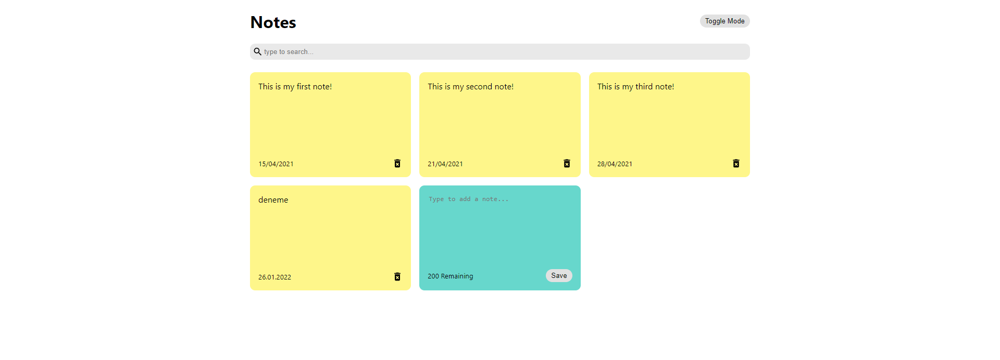

# → React İle Not Tutma Uygulaması ←

> ### Proje Link 📎 → https://silly-banach-c9bf37.netlify.app

<br>

>↓ Uygulama İçi Görsel ↓ 🖼



<br>

>↓ Kullanılan Araçlar ↓ 🛠

* HTML
* CSS
* REACT.js

<br>

>↓ Kurulum ↓ 🧱

```
npm install
npm install react-icons --save
npm start
```

<br>

> → İletişim →  📩 :
> alicanbayazit300@gmail.com
